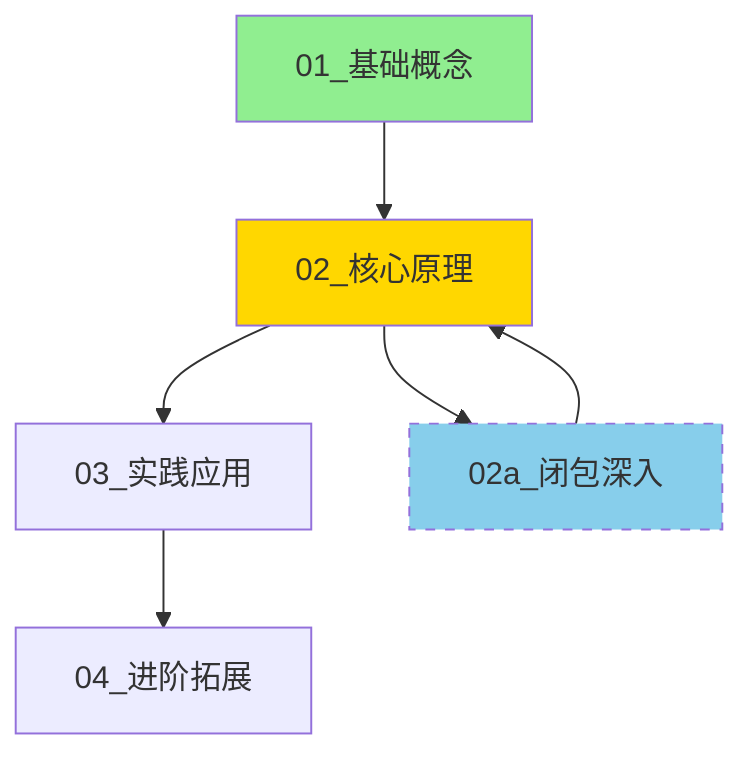

# Interactive Learning

交互式学习系统，基于Bloom的"2 Sigma问题"理论和掌握学习原则。

## 核心特性

- 📚 **结构化学习路径** - 自动规划课程，循序渐进
- 🌿 **分支探索机制** - 深入探讨某个概念后回归主线
- 🔗 **Obsidian双向链接** - 知识图谱可视化，知识点互联
- 🧠 **动态上下文管理** - 按需加载，避免AI幻觉
- 🔄 **跨对话继续学习** - 开新对话也能无缝恢复进度
- 📊 **可视化知识图谱** - Mermaid图表展示学习进度

## 理论基础

基于Benjamin Bloom的"2 Sigma问题"研究：一对一辅导的学生比普通课堂学生表现高出2个标准差（超越96%的课堂学生）。

**核心原则：掌握学习（Mastery Learning）**——学生真正理解内容后，才推进到下一阶段。

## 安装

将此skill复制到你的Claude Code skills目录：

```bash
# 项目级使用
cp -r skills/interactive-learning ~/.claude/skills/
```

## 快速开始

### 1. 启动学习

```
我想学习Docker容器技术
```

或

```
教我Python基础
```

### 2. 分支探索

当某个概念需要深入时：

```
深入探讨闭包
```

系统会创建分支课程，深入讲解后可回归主线。

### 3. 回归主线

```
回到主线
```

结束分支探索，带回关键收获，继续主学习路径。

### 4. 其他命令

| 命令 | 说明 |
|-----|------|
| `继续学习` | 恢复上次的学习进度（开新对话也能用） |
| `继续学习X` | 恢复特定主题的学习进度 |
| `继续下一课` | 进入下一课 |
| `回顾 [课程名]` | 复习指定课程 |
| `当前进度` | 查看学习状态 |
| `知识图谱` | 查看完整学习路径图 |
| `学习历史` | 查看所有主题的学习进度 |

## 目录结构

```
D:\zhk02\Desktop\DailyNote\10_学习\
├── Python基础\
│   ├── 进度.md              # 学习进度跟踪
│   ├── 知识图谱.md          # Mermaid可视化图谱
│   ├── 01_变量与数据类型.md
│   ├── 02_函数基础.md
│   ├── 02a_闭包深入.md      # 分支课程
│   └── 03_面向对象.md
└── Docker容器\
    ├── 进度.md
    ├── 知识图谱.md
    └── 01_镜像与容器基础.md
```

## 知识图谱可视化

在Obsidian中打开 `知识图谱.md`，可以看到Mermaid图表：



## Obsidian集成

### 双向链接

所有课程文件使用Obsidian链接语法：

```markdown
前置知识：[[01_基础概念]]
延伸学习：[[02a_闭包深入]]
参考：[[03_实践应用#装饰器应用]]
```

### 在Obsidian中

1. 打开学习目录作为Vault
2. 使用Graph View查看知识图谱
3. 点击链接跳转相关课程
4. 使用Backlinks查看反向链接

## 动态上下文管理

### 问题：长对话导致AI幻觉

传统对话式学习：
```
对话越来越长 → AI遗忘早期内容 → 产生幻觉 → 教学质量下降
```

### 解决方案：动态加载

每次交互按需读取文件：
```
识别当前状态 → 加载必要上下文 → 生成响应 → 更新文件
```

关键设计：
- 每个文件开头的 **上下文摘要** 块
- 分支探索时携带 **最小必要上下文**
- 回归主线时只带回 **关键收获摘要**

---

## 跨对话继续学习

### 核心原则：文件即状态

**对话是短暂的，文件是永久的。** 所有学习状态都存储在文件中。

### 开新对话继续学习

```
用户: 继续学习

Claude: 扫描学习目录，发现你有3个学习进度：

| # | 主题 | 当前位置 | 状态 | 上次更新 |
|---|------|---------|------|---------|
| 1 | Python基础 | 02_核心原理 | 分支探索中 | 2024-01-16 |
| 2 | Docker容器 | 01_基础概念 | 学习中 | 2024-01-14 |
| 3 | 机器学习 | 02_监督学习 | 学习中 | 2024-01-10 |

回复数字或主题名继续。
```

### 恢复机制

选择后，AI自动：
1. 读取进度文件中的"恢复点"
2. 读取当前课程文件
3. 加载上下文摘要（已掌握概念、当前重点）
4. 确认状态后继续学习

### 多设备同步

由于所有状态都在文件中：
- 使用云同步（iCloud、Dropbox等）同步学习目录
- 在不同设备上继续学习
- 甚至可以用不同的AI工具

## 学习文件结构

每个学习文件包含：

| 部分 | 说明 |
|------|------|
| 课程信息 | 前置知识、分支来源、学习目标 |
| 内容讲解 | 核心概念，使用类比和例子 |
| 小结 | 3-5条关键点 |
| 知识链接 | 相关课程的Obsidian链接 |
| 检查站 | 2-4个问题，验证掌握程度 |

## 教学风格

1. **费曼技巧** - 用简单语言解释复杂概念
2. **苏格拉底式提问** - 用问题引导思考
3. **脚手架原则** - 从已知推向未知
4. **鼓励犯错** - 错误是诊断理解深度的工具

## 自定义学习目录

如需修改默认学习目录，编辑 `SKILL.md` 中的路径：

```markdown
## 学习目录

所有学习主题在以下目录下创建子文件夹：
```
你的自定义路径\
```
```

## 示例对话

**用户**：我想学习Python函数

**Claude**：
1. 创建 `Python函数\` 文件夹
2. 生成 `进度.md`、`知识图谱.md` 和 `01_函数基础.md`
3. 展示学习内容，结尾有检查站问题

**用户**：深入探讨闭包

**Claude**：
1. 创建分支文件 `02a_闭包深入.md`
2. 携带上下文摘要进入分支
3. 深入讲解闭包

**用户**：回到主线

**Claude**：
1. 总结分支收获
2. 更新知识图谱和进度
3. 回到主线课程

**用户**：回答检查站问题...

**Claude**：
- 判断掌握程度
- 给出反馈
- 生成下一课或补充材料

## 许可证

Apache-2.0
